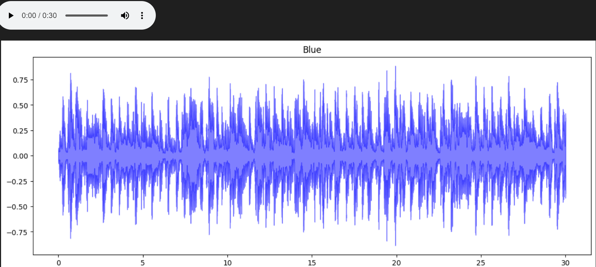
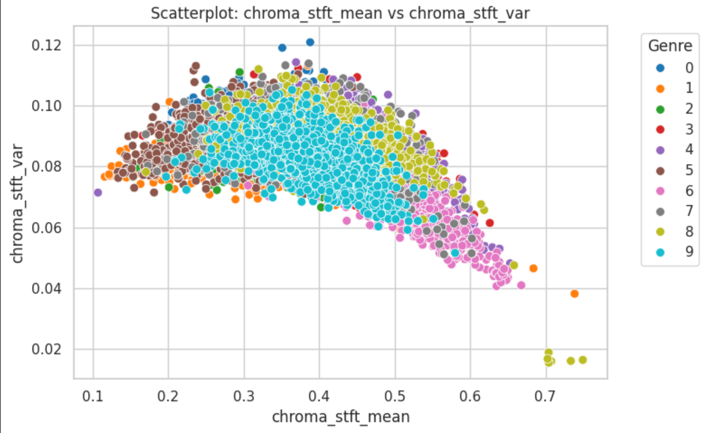
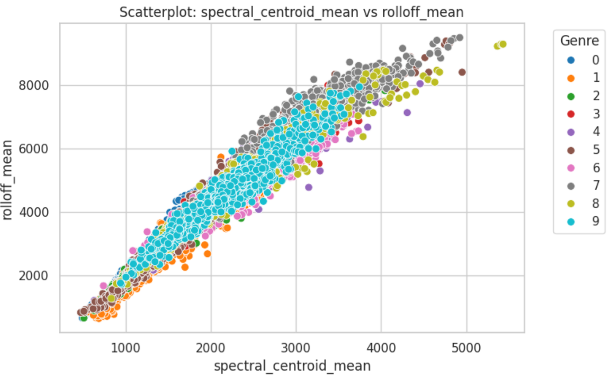

# Music Genre Classification
This project uses Machine Learning techniques to classify music into different genres based on audio features extracted from the sound files. It demonstrates a practical use of signal processing and ML for audio analysis.

# Project Overview
- **Goal**: Predict the genre of a music file using features like MFCCs, Chroma, and Spectral Contrast.
- **Dataset**: [GTZAN Music Genre Dataset](https://www.kaggle.com/datasets/andradaolteanu/gtzan-dataset-music-genre-classification)
- **Genres Included**: Classical, Pop, Rock, Jazz, Hip-Hop, Blues, etc.

# Technologies Used
- Python
- Librosa (for audio feature extraction)
- NumPy, Pandas
- Scikit-learn
- Matplotlib, Seaborn
- Jupyter Notebook

# Features Extracted
- MFCC (Mel-Frequency Cepstral Coefficients)
- Chroma Frequencies
- Spectral Centroid
- Zero Crossing Rate
- Spectral Roll-off

# Model Building Steps:
  1. Data Collection:
     Source : Kaggle
     Dataset Used: - **Dataset**: [GTZAN Music Genre Dataset](https://www.kaggle.com/datasets/andradaolteanu/gtzan-dataset-music-genre-classification)
     Genres Included: Blues, Classical, Country, Disco, Hiphop, Jazz, Metal, Pop, Reggae, Rock.

  2. Data Preprocessing
     Data preprocessing is the first and most important step in any machine learning pipeline.It means cleaning, transforming, and preparing your raw data so that a machine       learning model can understand and learn from it.
     Label Encoding	LabelEncoder().fit_transform()	Converts genres to numbers
     Feature/Label Split	X = data.drop(), y = data['label']	Separates inputs & target
     Scaling	MinMaxScaler()	Normalizes data (not yet applied)

  3. Data Visualization
     Purpose: Make complex data understandable and detect patterns and trends.
     
     i.Visualize the audio files using librosa library
     

     ii.Scatterplot Visualization
       

      
     
     
     

